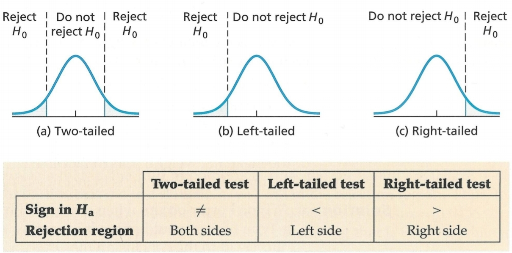

```{r setup, include=FALSE}
knitr::opts_chunk$set(echo = TRUE)
```

```{r echo=F}
mean_plot <- function(ma, mb, va, vb, na, nb, alpha=0.05, 
                      x=NULL, y=NULL, 
                      alternative = c("two.sided", "less", "greater")){
  if(!is.null(x) && !is.null(y)){
    ma <- mean(x, na.rm = TRUE)
    mb <- mean(y, na.rm = TRUE)
    va <- var(x, na.rm = TRUE)
    vb <- var(y, na.rm = TRUE)
    na <- length( na.omit(x) )
    nb <- length( na.omit(y) )
  }
  
  par(mar=c(2,2,1,1) )
  font_size <- 0.8
  cr <- "brown1"
  ca <- "springgreen3"
  S2 <- ((na-1)*va + (nb-1)*vb) / (na+nb-2)
  OVTS <- (ma-mb) / sqrt(S2/n1 + S2/n2)
  
  if(alternative == "less"){
    FVTS <- qt(alpha, na+nb-2)
    
    xmin <- min(-2.5, OVTS + -0.15, FVTS + -0.5)
    xmax <- max(2.5, OVTS + 0.15, FVTS + 0.5) +1.5
    
    xk <- seq(xmin, xmax, 0.01)
    yk <- dt( xk, df = na + nb-2 )
    plot(xk, yk, type = "l", xaxt="n",
         ylab = "densitat", xlab = "x", xlim = c(xmin, xmax), cex.axis=font_size)
    xl <- round( c(OVTS, FVTS), 2)
    axis(1, at = xl,labels=xl, col.axis=1, cex.axis=font_size)
    
    x1 <- seq(xmin, FVTS, 0.01)
    y1 <- dt( x1, df = na + nb - 2 )
    x2 <- seq(FVTS, xmax,  0.01)
    y2 <- dt( x2, df = na + nb- 2 )
    
    polygon(c(x1,FVTS, xmin), c(y1,0,0), col = cr, border = cr, density = 25)
    polygon(c(x2, xmax, FVTS), c(y2,0,0), col = ca, border = ca, density = 25)
    lines( x = c(OVTS, OVTS), y = c(0, max(dt(OVTS, na+nb-2), max(yk)/10)), lwd = 1.25 )
    pval <- pt(OVTS, na + nb-2)
  }
  else if(alternative == "greater"){
    FVTS <- qt(1-alpha, na+nb-2)
    
    xmin <- min(-2.5, OVTS + -0.15, FVTS + -0.5)
    xmax <- max(2.5, OVTS + 0.15, FVTS + 0.5) +1.5
    
    xk <- seq(xmin, xmax, 0.01)
    yk <- dt( xk, df = na + nb-2 )
    plot(xk, yk, type = "l", xaxt="n",
         ylab = "densitat", xlab = "x", xlim = c(xmin, xmax), cex.axis=font_size)
    xl <- round( c(OVTS, FVTS), 2)
    axis(1, at = xl,labels=xl, col.axis=1, cex.axis=font_size)
    
    x1 <- seq(xmin, FVTS, 0.01)
    y1 <- dt( x1, df = na + nb - 2 )
    x2 <- seq(FVTS, xmax,  0.01)
    y2 <- dt( x2, df = na + nb- 2 )
    
    polygon(c(x1,FVTS, xmin), c(y1,0,0), col = ca, border = ca, density = 25)
    polygon(c(x2, xmax, FVTS), c(y2,0,0), col = cr, border = cr, density = 25)
    lines( x = c(OVTS, OVTS), y = c(0, max(dt(OVTS, na+nb-2), max(yk)/10)), lwd = 1.25 )
    pval <- 1-pt(OVTS, na + nb-2)
  } else if(alternative == "two.sided"){
    FVTS1 <- qt(alpha/2, na+nb-2)
    FVTS2 <- -FVTS1
    
    xmin <- min(-2.5, OVTS - 0.15, FVTS1 + 0.5, FVTS2 + 0.5)
    xmax <- max(2.5, OVTS + 0.15, FVTS1 + 0.5, FVTS2 + 0.5) +1.5
    
    xk <- seq(xmin, xmax, 0.01)
    yk <- dt( xk, df = na + nb-2 )
    
    plot(xk, yk, type = "l", xaxt="n",
         ylab = "densitat ", xlab = "x", xlim = c(xmin, xmax), cex.axis=font_size)
    xl <- round( c( OVTS, FVTS1, FVTS2), 2)
    axis(1, at = xl,labels=xl, col.axis=1, cex.axis=font_size)
    
    
    x1 <- seq(xmin, FVTS1, 0.01)
    y1 <- dt( x1, df = na + nb - 2 )
    x2 <- seq(FVTS1, FVTS2,  0.01)
    y2 <- dt( x2, df = na + nb- 2 )
    x3 <- seq(FVTS2, xmax,  0.01)
    y3 <- dt( x3, df = na + nb- 2 )

    lines( x = c(OVTS, OVTS), y = c(0, max(dt(OVTS, na+nb-2), max(yk)/10)), lwd = 1.25 )
    
    polygon(c(x1, FVTS1, xmin), c(y1,0,0), col = cr, border = cr, density = 25)
    polygon(c(x2, FVTS2, FVTS1), c(y2,0,0), col = ca, border = ca, density = 25)
    polygon(c(x3, xmax, FVTS2), c(y3,0,0), col = cr, border = cr, density = 25)
    
    pval <- 2*pt(-abs(OVTS), na+nb-2)
  }
  legend("topright", inset = 0.01,  
         legend=c("Àrea no rebuig H0", "Àrea rebuig H0", "Valor OVTS", "alpha", alpha, "p-valor", round(pval, 5)),
         col=c(ca, cr, 1, NA, NA, NA, NA), lty=1, box.lty=0, cex=font_size)
}
  
var_plot <- function(va, vb, na, nb, alpha=0.05, 
                     x=NULL, y=NULL, 
                     alternative = c("two.sided", "less", "greater")){
  if(!is.null(x) && !is.null(y)){
    va <- var(x, na.rm = TRUE)
    vb <- var(y, na.rm = TRUE)
    na <- length( na.omit(x) )
    nb <- length( na.omit(y) )
  }
  par(mar=c(2,2,1,1) )
  font_size <- 0.75
  cr <- "brown1"
  ca <- "springgreen3"
  OVTS <- va / vb
  if(alternative == "greater"){
    FVTS <- qf(1-alpha, df1 = na-1, df2 = nb-1 )
    xmax <- max(2.5, OVTS + 0.15, FVTS + 0.5)
    xk <- seq(0, xmax, 0.01)
    yk <- df( xk, df1 = na-1, df2 = nb-1 )
    plot(xk, yk, type = "l", xaxt="n",
         ylab = "densitat", xlab = "x", xlim = c(0, xmax), cex.axis=font_size)
    xl <- round( c(OVTS, FVTS), 2)
    axis(1, at = xl,labels=xl, col.axis=1, cex.axis=font_size)
    x1 <- seq(0, FVTS, 0.01)
    y1 <- df( x1, df1 = na-1, df2 = nb-1 )
    x2 <- seq(FVTS, xmax,  0.01)
    y2 <- df( x2, df1 = na-1, df2 = nb-1 )
    polygon(c(x1,FVTS, 0), c(y1,0,0), col = ca, border = ca, density = 25)
    polygon(c(x2, xmax, FVTS), c(y2,0,0), col = cr, border = cr, density = 25)
    lines( x = c(OVTS, OVTS), y = c(0, max(df(OVTS, na-1, nb-1), max(yk)/10)), lwd = 1.25 )
    pval <- 1 - pf(OVTS, na-1, nb-1)
    }
    else if(alternative == "less"){
    FVTS <- qf(alpha, df1 = na-1, df2 = nb-1 )
    xmax <- max(2.5, OVTS + 0.15, FVTS + 0.5)
    xk <- seq(0, xmax, 0.01)
    yk <- df( xk, df1 = na-1, df2 = nb-1 )
    plot(xk, yk, type = "l", xaxt="n",
         ylab = "densitat", xlab = "x", xlim = c(0, xmax), cex.axis=font_size)
    xl <- round( c(OVTS, FVTS), 2)
    axis(1, at = xl,labels=xl, col.axis=1, cex.axis=font_size)
    x1 <- seq(0, FVTS, 0.01)
    y1 <- df( x1, df1 = na-1, df2 = nb-1 )
    x2 <- seq(FVTS, xmax,  0.01)
    y2 <- df( x2, df1 = na-1, df2 = nb-1 )
    polygon(c(x1,FVTS, 0), c(y1,0,0), col = cr, border = cr, density = 25)
    polygon(c(x2, xmax, FVTS), c(y2,0,0), col = ca, border = ca, density = 25)
    lines( x = c(OVTS, OVTS), y = c(0, max(df(OVTS, na-1, nb-1), max(yk)/10)), lwd = 1.25)
    pval <- pf(OVTS, na-1, nb-1)
    }
    else if(alternative == "two.sided"){
    FVTS1 <- qf(alpha/2, df1 = na-1, df2 = nb-1 )
    FVTS2 <- qf(1-alpha/2, df1 = na-1, df2 = nb-1 )
    xmax <- max(2.5, OVTS + 0.15, FVTS2 + 0.5)
    xk <- seq(0.01, xmax, 0.01)
    yk <- df( xk, df1 = na-1, df2 = nb-1 )
    plot(xk, yk, type = "l", xaxt="n",
         ylab = "densitat ", xlab = "x", xlim = c(0, xmax), cex.axis=font_size)
    xl <- round( c( OVTS, FVTS1, FVTS2), 2)
    axis(1, at = xl,labels=xl, col.axis=1, cex.axis=font_size)

    x1 <- seq(0, FVTS1, 0.01); y1 <- df( x1, df1 = na-1, df2 = nb-1 )
    x2 <- seq(FVTS1, FVTS2,  0.01); y2 <- df( x2, df1 = na-1, df2 = nb-1 )
    x3 <- seq(FVTS2, xmax,  0.01); y3 <- df( x3, df1 = na-1, df2 = nb-1 )
    
    lines( x = c(OVTS, OVTS), y = c(0, max(df(OVTS, na-1, nb-1), max(yk)/10)), lwd = 1.25 )

    polygon(c(x1, FVTS1, 0), c(y1,0,0), col = cr, border = cr, density = 25)
    polygon(c(x2, FVTS2, FVTS1), c(y2,0,0), col = ca, border = ca, density = 25)
    polygon(c(x3, xmax, FVTS2), c(y3,0,0), col = cr, border = cr, density = 25)
    
    pval <- sum( pf(min(OVTS, 1/OVTS), na-1, nb-1), 1 - pf(max(OVTS, 1/OVTS), na, nb))
    }
    legend("topright", inset = 0.01,  
         legend=c("Àrea no rebuig H0", "Àrea rebuig H0", "Valor OVTS", "alpha", alpha, "p-valor", round(pval, 5)),
         col=c(ca, cr, 1, NA, NA, NA, NA), lty=1,  box.lty=0, cex=font_size)
}

```

Recordatori regións de no rebuig (blanc) i de rebuig (gris) de $H_0$ en tests de comparació de paràmetres ($H_a$ fa referència a la hipòtesi alternativa, en el nostre cas $H_1$)
<a id="fig1"></a>
<div align="center">
{width=85%}
</div>


## Exercici 57

An investor wants to compare the risks associated to two different stocks, A and B. Market risk is measured using the variance of the daily changes in stock prices. The investor believes that the risk in market A is lower than the risk in market B. Two random samples are selected, consisting of 21 observations on the changes of prices in market A and 16 observations on the changes of prices in market B. The results are:

<center>
|Market A      | Market B     |
|:-----------: | :----------: |
|$X_A = 0.3$   | $X_B = 0.3$  |
|$S_A = 0.45$  | $S_B = 0.25$ |
</center>

Assuming that both samples come from two Normal and independent populations, does the data support
the investor’s belief ? (α = 0.05)

Definim les hipòtesis primer. Com que el risc es mesura utilitzant la variància, el que volem veure és si la variància del stock del Market A és més petita que la variància del stock del Market B:

<div align="center">
$H_0: \ \sigma^2_A \ge \sigma^2_B$  
$H_1: \ \sigma^2_A < \sigma^2_B$  
</div>

L'estadístic de la prova (observed value of test statistic, OVTS) és $S_A^2 / S_B^2$.

```{r }
sa <- 0.45
sb <- 0.25
(OVTS <- sa^2 / sb^2)  # 3.24
```

Ara busquem l'estadístic de contrast, el qual es basa en la distribució $F_{na -1, nb -1}$. Al tractar-se d'un test unilateral esquerra ($H_1: \sigma^2_A < \sigma^2_B$) i que la significació és $\alpha = 0.05$, l'àrea de rebuig serà:

<div align="center">
$[0, F_{na -1, nb -1, alpha}]$
</div>


```{r }
na <- 21
nb <- 16
alpha <- 0.05
(qf( p = alpha, df1 = na-1, df2 = nb-1 ))  # 0.45387 
```

L'OVTS es troba fora de la regió de rebuig ja que $3.24 \notin [0, 0.46]$. Per tant, donada la mostra, no podem rebutjar la hipòtesi alternativa. No podem dir que hi ha menys risc al Market A que al Market B.


Gràficament:

```{r echo=F, fig.asp = .5, fig.align="center"}
var_plot(va = sa^2, vb = sb^2, na=na, nb=nb, alternative = "less")
```

L'àrea en verd ens mostra a l'eix de les x la regió de no rebuig de la $H_0$, entre 0.45 i +Inf, mentres que l'àrea en vermell ens mostra l'àrea de rebuig de $H_0$, entre 0 i 0.45 Com que el nostre estadístic (3.24) queda dintre de la regió d'acceptació, (línia negra) no rebutgem $H_0$

## Exercici 59

In a Hospital 7 patients were selected, observing that they slept 7, 5, 8, 8.5, 6, 7 i 8 hours respectively. All of them were given a new sleeping pill, and then 5 of them were selected, observing 9, 8.5, 9.5, 10 i 8 sleep hours respectively. Is the new pill effective ? (Assume normality and $\alpha$ = 0.05)

Volem veure si el medicament augmenta les hores de son dels pacients. Així doncs, les hipòtesis les definim com:

<div align="center">
$H_0: \ \mu_1 - \mu_2 \ge 0$  
$H_1: \ \mu_1 - \mu_2 < 0$  
</div>

Ara bé, s'ha de comprovar si les variàncies són iguals, pel que definim també:

<div align="center">
$H_0: \ \sigma^2_1 = \sigma^2_2$  
$H_1: \ \sigma^2_1 \ne \sigma^2_2$  
</div>

```{r results="hold"}
no_pill <- c(7, 5, 8, 8.5, 6, 7, 8)
si_pill <- c(9, 8.5, 9.5, 10, 8)
( s21 <- var( no_pill) ) # 1.535714
( s22 <- var( si_pill) ) # 0.625
( OVTS <- s21 / s22 )    # 2.457143
```

Ara busquem l'estadístic de contrast, el qual es basa en la distribució $F_{na -1, nb -1}$. Al tractar-se d'un test bilateral ($H_1: \sigma^2_A \ne \sigma^2_B$) i que la significació és $\alpha = 0.05$, l'àrea de rebuig serà:

<div align="center">
$[0, F_{na -1, nb -1, alpha/2}]$ i $[F_{na -1, nb -1, 1 - alpha/2}, +\infty]$
</div>

```{r results="hold"}
n1 <- length( no_pill ) # 7
n2 <- length( si_pill ) # 5
alpha <- 0.05
FVTS1 <- qf(alpha/2, df1 = n1-1, df2 = n2-1 )  # 0.1605868
FVTS2 <- qf(1-alpha/2, df1 = n1-1, df2 = n2-1 ) # 9.197311
```

Com que 2.45 no està dintre de l'àrea de rebuig $[0,0.16]\cup[9.19,+\infty]$, no rebutgem $H_0$, és a dir, no podem dir que les variàncies siguin diferents.

Gràficament:
```{r echo=F, fig.asp = .5, fig.align="center"}
var_plot(x=no_pill, y=si_pill, alternative = "two.sided")
```

Ara, utilitzant el resutlat anterior, podem dir que l'estadístic de la prova és:

<div align="center">
$\frac{\bar{X_1} - \bar{X_2}}{\sqrt{\frac{S^2}{n_1} + \frac{S^2}{n2} }} \quad$ on $\quad S^2 = \frac{(n_1 -1)S^2_1 + (n_2 -1)S^2_2}{n_1 + n_2 -2}$
</div>

El qual, sota la hipòtesis nul.la, segueix una distribució $t_ {n_1+n_2-2}$. Al tractar-se d'un test unilateral i amb $\alpha = 0.05$, la regió de rebuig es troba a l'esquerra delimitada pel valor crític $t_ {10, \alpha}$

```{r echo=F, fig.asp = .5, fig.align="center"}
alpha <- 0.05
qt(alpha, n1+n2-2)
```

Per trobar l'estadístic, cal calcular:

```{r results="hold"}
( m1 <- mean(no_pill) ) # 7.071429
( s21 <- var(no_pill) ) # 1.535714
( m2 <- mean(si_pill) ) # 9
( s22 <- var(si_pill) ) # 0.625
( S2 <- ( (n1 - 1) * s21 + ( n2 - 1 ) * s22) / ( n1 + n2 - 2 ) ) # 1.171429

```

<div align="center">
$\bar{X_1} = 7.07 \quad S^2_1 = 1.53$  
$\bar{X_2} = 9 \quad S^2_2 = 0.62$  
$S^2 = 1.17$
</div>

Calculem l'estadístic:

```{r }
( OVTS <- (m1-m2) / sqrt( S2/n1 + S2/n2) ) # -3.043135

```

Donat qu el valor observat es troba fora la regió d'acceptació, -3.04 < -1.812, hi ha prou evidències per rebutjar $H_0$.

Utilitzant l'R, primer mirem si les variàncies les podem considerar no diferents amb `var.test()` i després apliquem la funció `t.test()`:

```{r }
var.test(x=no_pill, y=si_pill, alternative = "two.sided", conf.level = 0.95)
```

Com que el $p$-valor és més gran que la significació, no podem dir que les variàncies siguin diferents. Fem ara el `t.test()` tot indicant que les variànces no són diferents (`var.equal = TRUE`):

```{r }
t.test(x=no_pill, y=si_pill, alternative = "less", var.equal = TRUE, conf.level = 0.95)
```

Com que el $p$-valor$=0.006$ és més petit que $\alpha = 0.05$, rebutgem $H_0$. És a dir, no podem dir que el medicament no faci que els pacients dormin més hores en mitjana.

Gràficament:

```{r echo=F, fig.asp = .5, fig.align="center"}
mean_plot(x=no_pill, y=si_pill, alternative = "less")
```


## Exercici 60

Random errors in two measuring tools follow Normal distributions $N(0, \sigma^2_1)$ i $N(0, \sigma^2_1)$. In a sample of size 7 the following measuring errors are observed:

<div align="center">
 First tool: 1.6, -0.9, -2.8, 3.1, 4.2, -1.0, 2.1  
 Second tool: 0.3, 0.7, -1.1, 2.0, 1.7, -0.8, -0.5
</div>

If we assume that the sampling was conducted over two normal and independent populations, can we conclude that the first tool is more precise than the second tool?

En aquest cas volem veure si la variabilitat de la primera eina és més baixa que al de la segona eina. Així doncs, les hipòtesis són:

<div align="center">
$H_0: \ \sigma^2_A \ge \sigma^2_B$  
$H_1: \ \sigma^2_A < \sigma^2_B$  
</div>

L'estadístic de la prova (OVTS) és $S^2_A /S^2_B$, el calculem:
```{r , results="hold"}
( s2a <- var( c(1.6, -0.9, -2.8, 3.1, 4.2, -1.0, 2.1) ) ) # 6.366667
( s2b <- var( c(0.3, 0.7, -1.1, 2.0, 1.7, -0.8, -0.5) ) ) # 1.469048
( OVTS <- s2a / s2b )  # 4.333874
```

Ara busquem l'estadístic de contrast, el qual es basa en la distribució $F_{na -1, nb -1}$. Al tractar-se d'un test unilateral esquerra ($H_1: \sigma^2_A < \sigma^2_B$) i que la significació és $\alpha = 0.05$, l'àrea de rebuig serà:

<div align="center">
$[0, F_{na -1, nb -1, alpha}]$
</div>

```{r }
na <- length( c(1.6, -0.9, -2.8, 3.1, 4.2, -1.0, 2.1) ) # 7
nb <- length( c(0.3, 0.7, -1.1, 2.0, 1.7, -0.8, -0.5) ) # 7
alpha <- 0.05
(qf( p = alpha, df1 = na-1, df2 = nb-1 ))  # 0.233434
```

Com que l'estadístic OVTS (4.33) es troba fora de regió de rebuig [0, 0.23], podem dir que donada la mostra hi ha prou evidència per a no rebutjar la hipòtesi nul.la. És a dir, no podem dir que la presició de la primera eina sigui més alta que la de la segona eina.

En aquest cas al tenir les dues mostres, podem aplicar la funció `var.test()`:

```{r }
toolA <- c(1.6, -0.9, -2.8, 3.1, 4.2, -1.0, 2.1)
toolB <- c(0.3, 0.7, -1.1, 2.0, 1.7, -0.8, -0.5)
var.test(x=toolA, y=toolB, alternative = "less")
```

Pel que amb $p$-valor $= 0.9512 > 0.05 = \alpha$, no rebutgem la hipòtesi nul.la.

Gràficament:

```{r echo=F, fig.asp = .5, fig.align="center"}
var_plot(x=toolA, y=toolB, alternative = "less")
```

L'àrea en verd ens mostra a l'eix de les x la regió de no rebuig de la $H_0$, entre el 0.23 i +Inf, mentres que l'àrea en vermell ens mostra l'àrea de rebuig de $H_0$, entre 0 i 0.23 Com que el nostre estadístic (4.33) queda dintre de la regió d'acceptació, (línia negra) no rebutgem $H_0$.

<!---
L'interval de confiança amb una significació $\alpha$ per a un test unilateral esquerra l'obtenim fent:

<div align="center">
$(0, \frac{s^2_A}{s^2_B} \cdot \frac{1}{F_{na -1, nb -1, alpha}})$ o també $(0, \frac{s^2_A}{s^2_B} \cdot F_{na -1, nb -1, 1 - alpha})$
</div>

```{r results="hold"}
( c(0,  s2a / s2b *  1 / qf( p = alpha, df1 = na-1, df2 = nb-1 ) ) )
( c(0,  s2a / s2b *  qf( p = 1 - alpha, df1 = na-1, df2 = nb-1 ) ) )
```


Per ampliar una mica, seguint el raonament de la [Figura 1](#fig1):

* en el cas que fós un test unilateral i $H_0: \ \sigma^2_A \le \sigma^2_B$, l'àrea de rebuig serà:

<div align="center">
$[F_{na -1, nb -1, 1-alpha}, +\infty ]$ 
</div>

* en el cas que fós un test bilateral amb $H_0: \ \sigma^2_A = \sigma^2_B$, l'àrea de rebuig serà:

<div align="center">
$[ 0, F_{na -1, nb -1, alpha/2} ]$ i $[F_{na -1, nb -1, 1-alpha/2},  +\infty  ]$ 
</div>
-->


## Exercici 62

A consumer association wants to compare several alkaline battery brands. Two random samples , both of size 50, corresponding to the two main brands in the market (sample A and sample B) are obtained. Each element in each sample is plugged into an electronic device to measure its lifespan. Assume that the lifespan of batteries follows a Normal distribution and that the samples were drawn independently. The sample mean for the lifespan of the batteries in samples A and B were 41 and 45 hours respectively, and the standard deviations 2 and 1.8 hours respectively. Answer the following questions:

a. Can we infer from the information gathered that the batteries of brand B have a lifespan with less variability? (use a significance level of α = 0.05)

<div align="center">
$H_0: \ \sigma^2_A \le \sigma^2_B$  
$H_1: \ \sigma^2_A > \sigma^2_B$  
</div>

Hem de veure si acceptem o rebutgem $H_0$, per a fer-ho utilitzem el estadístic $S^2_A / S^2_B$ (variància mostral de la bateria A dividit entre la variància mostral de la bateria B). L'estadístic de la prova (observed value of test statistic, OVTS) és $S_A^2 / S_B^2$.
```{r }
sa <- 2
sb <- 1.8
(OVTS <- sa^2 / sb^2)  # 1.234568
```


Ara busquem l'estadístic de contrast, el qual es basa en la distribució $F_{na -1, nb -1}$. Al tractar-se d'un test unilateral dreta ($H_1: \sigma^2_A > \sigma^2_B$) i que la significació és $\alpha = 0.05$, l'àrea de rebuig serà:

<div align="center">
$[F_{na -1, nb -1, 1-alpha}, +\infty]$
</div>

Utilitzarem la funció qf() (recomanable veure el help per a exemples d'ús), amb una significació $\alpha = 0.05$

```{r }
na <- 50
nb <- 50
alpha <- 0.05
(qf( p = 1-alpha, df1 = na-1, df2 = nb-1 ))  # 1.607289
```

Com que 1.23 no entra dintre de la regió de rebuig [1.61, +Inf), no rebutgem $H_0$. És a dir, no podem dir que la vida útil de les bateries de la marca B tingui una variabilitat menor que les de la marca A.

Gràficament:

```{r echo=F, fig.asp = .5, fig.align="center"}
var_plot(va = sa^2, vb = sb^2, na=na, nb=nb, alternative = "greater")
```

L'àrea en verd és de 1-alpha = 0.95 i ens mostra a l'eix de les x la regió de no rebuig de la $H_0$, entre el 0 i 1.61, mentres que l'àrea en vermell és de alpha = 0.05 i ens mostra l'àrea de rebuig de $H_0$, entre 1.61 i +Inf. Com que el nostre estadístic (1.21) queda dintre de la regió d'acceptació, (línia negra) no rebutgem $H_0$

Quin és el p-valor? Haurem de calcular l'àrea més a la dreta de la línia negra [OVTS, +Inf)
```{r results="hold"}
pf( OVTS, df1=na-1, df2=nb-1, lower.tail = F ) #  0.2317496
```
En termes de p-valor, no rebutgem $H_0$ ja que 0.23 > 0.05.

<!---
Farem el problema a l'inrevés, voldrem veure si:  

<div align="center">
$H_0: \ \sigma^2_B \ge \sigma^2_A$  
$H_1: \ \sigma^2_B < \sigma^2_A$  
</div>

Calcuem l'OVTS
```{r }
sa <- 2
sb <- 1.8
(OVTS <- sb^2 / sa^2)  # 0.81
```

Busquem l'estadístic de contrast, el qual és una distribució F amb nb -1 i na -1 graus de llibertat (alerta, hen girat els graus de llibertat!) amb una significació $\alpha = 0.05$. En aquest cas haurem de mirar la cua esquerra! En comptes de fer 1-alpha, apliquem alpha

```{r }
na <- 50
nb <- 50
alpha <- 0.05
(qf( p = alpha, df1 = na-1, df2 = nb-1 ))  # 0.6221655
```

com que 0.81 no entra dintre de la regió de rebuig [0, 0.62], no rebutgem $H_0$ (rebutgem $H_1$)

Veiem-ho gràficament:

```{r echo=F}
x <- seq(0, 2.5, 0.01)
y <- df( x, df1 = nb-1, df2 = na-1 ) # graus de llibertat girats!
ca <- 3
cr <- 2
plot(x, y, type = "l", main = "Distribució F amb nb-1 i na-1 gl") 
x1 <- seq(0, 0.6221655, 0.01); y1 <- df( x1, df1 = nb-1, df2 = na-1 )
x2 <- seq(0.6221655, 2.5,  0.01); y2 <- df( x2, df1 = nb-1, df2 = na-1 )
polygon(c(x1,0.6221655, 0), c(y1,0,0), col = cr, border = cr, density = 25)
polygon(c(x2, 2.5, 0.6221655), c(y2,0,0), col = ca, border = ca, density = 25)
abline(v = OVTS)
```

Veiem que passa el mateix que abans, el valor OVTS entra dintre la regió d'acceptació de $H_0$.

I ara, quin serà el p-valor? Haurem de calcular l'àrea de 0 a la línia negra [0, OVTS]
```{r }
pf(OVTS, df1=na-1, df2=nb-1) #  0.2317496 -> és el mateix!
```
En termes de p-valor, no acceptem $H_1$ ja que 0.23 > 0.05


Per al cas bilateral ([Figura 1](#fig1)) seria:  

<div align="center">
$H_0: \ \sigma^2_A = \sigma^2_B$  
$H_0: \ \sigma^2_A \ne \sigma^2_B$   
</div>

Ho veiem gràficament només:

```{r echo=F}
OVTS <- sa^2 / sb^2 # 1.234568
rr1 <- qf( p = alpha / 2, df1 = na-1, df2 = nb-1 )  # 0.5674762 , límit regió rebuig esquerra
rr2 <- qf( p = 1 - alpha / 2, df1 = na-1, df2 = nb-1  ) # 1.762189 , límit regió rebuig dreta

x <- seq(0, 2.5, 0.01)
y <- df( x, df1 = na-1, df2 = nb-1 )
plot(x, y, type = "l", main = "Distribució F amb nb-1 i na-1 gl") 
x1 <- seq(0, 0.5674762, 0.01); y1 <- df( x1, df1 = nb-1, df2 = na-1 )
x2 <- seq(0.5674762, 1.762189,  0.01); y2 <- df( x2, df1 = nb-1, df2 = na-1 )
x3 <- seq(1.762189, 2.5,  0.01); y3 <- df( x3, df1 = nb-1, df2 = na-1 )
polygon(c(x1,0.5674762, 0), c(y1,0,0), col = 2, border = 2, density = 25)
polygon(c(x2, 1.762189, 0.5674762), c(y2,0,0), col = 3, border = 3, density = 25)
polygon(c(x3, 2.5, 1.762189), c(y3,0,0), col = 2, border = 2, density = 25)
abline(v = OVTS)
```

Com que 1.23 queda dintre de l'area de acceptació $(F_{na -1, nb -1, alpha/2}, F_{na -1, nb -1, 1-alpha/2}) = (0.57, 1.76)$, no rebutgem l'hipòtesi nul.la! És a dir, podem dir amb una significància del 95% que $\sigma^2_A \ne \sigma^2_B$. 
-->
